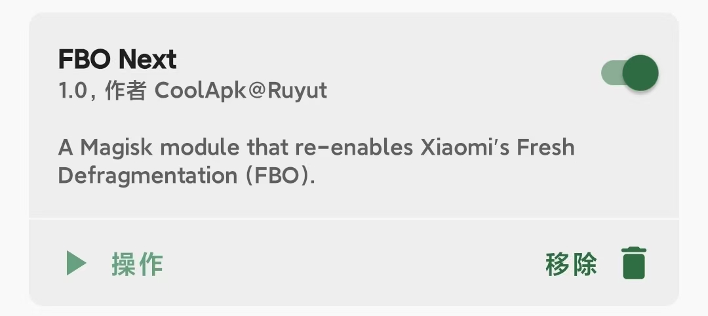

# FBO NEXT
### 介绍
一个重新开启小米焕新存储(FBO)的Magisk模块，该模块会在每次开机120s后启动FBO，并且会在每天8:00和23:30再次启动FBO  
模块日志路径：```/data/adb/modules/fbo_next/log.txt```

### 测试环境
__手机型号:__ XIAOMI 13  
__系统版本:__ 2.0.100.0  
理论支持 __Hyper OS 1.0__ 和 __Hyper OS 2.0__ ，具体请自测

### 使用方法
下载Releases中的压缩包后，在[Magisk](https://github.com/topjohnwu/Magisk)中刷入即可，另外点击 __操作__ 可以手动执行脚本
建议搭配[HyperCeiler](https://github.com/ReChronoRain/HyperCeiler)中的 __禁用HTML查看器云控__ 和 __解锁焕新存储__(如果没有该功能) 一起使用。


### 部分疑问
##### 1.如何修改开机后的等待时间？
修改```service.sh```的第5行代码```sleep 120s```
##### 2.如何修改定时任务？
修改```cron\crontabs\root```中的```30 0 * * *```，相关语法可以看[crond定时任务](https://blog.csdn.net/qq_22172133/article/details/81263736)
